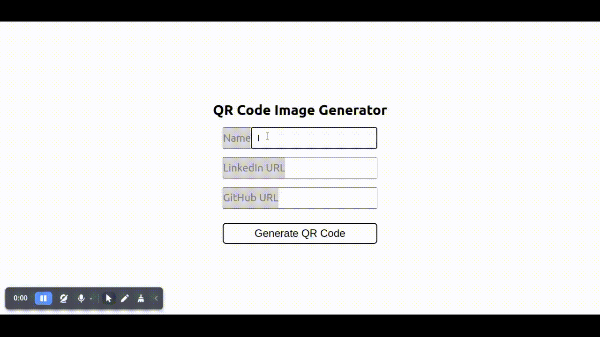

# Buzzvel

## Overview

## Goals

- Create a page that generates QR-code with link to user's profile;
- Users can download image;
- Users must fill some information that will be displayed in profile page;
- Mobile first;
- Create a profile page for each users has generated QR-code;

## Stacks

### DB
- SQLite

### Backend
- PHP
- Laravel

### Frontend
- NodeJS
- ReactJS
- NextJS
- Typescript

## Bonus
- Tests

## Requirements
- PHP
- Composer
- NodeJS
- NPM/Yarn

## How to use at local environment
Clone this repo.

`git clone https://github.com/Guilherme-del/joaoVirtualCard.git`

Go to cloned repo folder

`cd joaoVirtualCard`

Enter in backend folder
`cd backend`

Pass the `.env.example` to `.env`

Install the backend

`composer install`

Run backend server

`php artisan serve`

Open another terminal window to run frontend server and go to cloned repo folder

Enter in frontend folder

`cd frontend`

Install the frontend

`npm install`

Run frontend server in dev mode

`npm run dev`

### API Routes

| route | method | description |
|---|---|---|
| /api/user | POST | store the user information in DB |
| /api/users/${USER} | GET | return the user's data |

### WebApp Routes

| route | description |
| --- | --- |
| / | home page and form to generate link and QR code |
| /${USER} | shows the user information |

### Users Table

| Name | Field | Type | Description | OBS |
| --- | --- | --- | --- | --- |
| id | ID | INT | ID with auto incremention | Auto generated |
| created_at | Created At | INT | Time stamp | Auto generated by migrations |
| updated_at | Updated At | INT | Time stamp | Auto generated by migrations |
| full_name | Full Name | varchar | Full name of the user | Fill by user |
| linkedin_url | Linkedin URL | varchar | URL of the user's LinkedIn | Fill by user |
| github_url | GitHub URL | varchar | URL of the user's GitHub | Fill by user |
| profile | Profile | varchar | URL of the user | Generated by the system |

### Tests

To run backend tests run `php artisan test`

### Reference links

- [laravel](https://laravel.com/docs/9.x)
- [php](https://php.net)
- [npm](https://www.npmjs.com/package/qrcode.react)
- [next](https://nextjs.org)
- [qrcodeGenerator](https://github.com/nayuki/QR-Code-generator)
- [qrcode](https://www.npmjs.com/package/react-qr-code)
